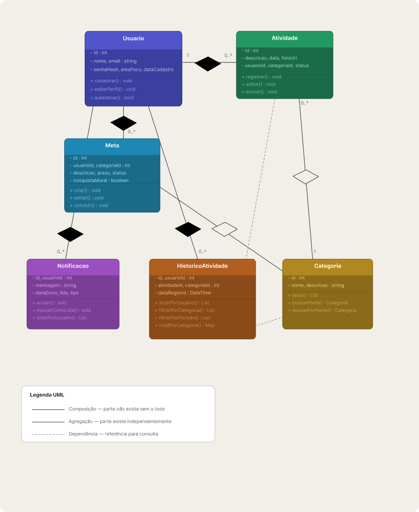

# Arquitetura da Solução

## Diagrama de Classes

O diagrama de classes ilustra graficamente como será a estrutura do software, e como cada uma das classes da sua estrutura estarão interligadas. Essas classes servem de modelo para materializar os objetos que executarão na memória.

O sistema WeDo é composto pelas seguintes classes principais:

- **Usuario** — representa o usuário da plataforma, com atributos como `id`, `nome`, `email`, `senhaHash`, `areaFoco` e `dataCadastro`, e métodos de cadastro, edição de perfil e autenticação.
- **Atividade** — registra as atividades realizadas pelo usuário, com `descricao`, `data`, `fotoUrl`, `status` e referências a `usuarioId` e `categoriaId`.
- **Meta** — define as metas do usuário, com `descricao`, `prazo`, `status` e o campo `conquistaMural` para conquistas no mural.
- **Categoria** — agrupa atividades e metas por categoria, com métodos de busca e listagem.
- **HistoricoAtividade** — mantém o histórico de atividades vinculadas ao usuário, com suporte a filtros por categoria e período.
- **Notificacao** — gerencia notificações enviadas ao usuário, com controle de leitura e tipo.

## Modelo ER (Projeto Conceitual)

O Modelo ER representa através de um diagrama como as entidades (coisas, objetos) se relacionam entre si na aplicação interativa.

O diagrama abaixo apresenta as entidades **usuario**, **atividade**, **meta**, **categoria**, **historico_atividade** e **notificacao**, e seus respectivos relacionamentos:

- Um **usuario** *Registra* N **atividade**s, *Define* N **meta**s e *Recebe* N **notificacao**s.
- Uma **atividade** e uma **meta** *Pertencem a* uma **categoria**.
- O **historico_atividade** é *Gerado* a partir das atividades e *Referencia* uma **categoria**.

## Projeto da Base de Dados

O projeto da base de dados corresponde à representação das entidades e relacionamentos identificadas no Modelo ER, no formato de tabelas, com colunas e chaves primárias/estrangeiras necessárias para representar corretamente as restrições de integridade.

O esquema abaixo detalha as tabelas do sistema e seus atributos:

| Tabela | Colunas principais |
|---|---|
| **usuario** | `id PK`, `nome VARCHAR(100)`, `email UNIQUE`, `senha_hash VARCHAR(150)`, `area_foco VARCHAR(100)`, `data_cadastro DATE` |
| **atividade** | `id PK`, `usuario_id FK`, `categoria_id FK`, `descricao VARCHAR(500)`, `data DATE`, `foto_url VARCHAR(500)`, `status VARCHAR(30)` |
| **meta** | `id PK`, `usuario_id FK`, `categoria_id FK`, `descricao VARCHAR(500)`, `prazo VARCHAR(100)`, `status VARCHAR(20)`, `conquista_mural BOOLEAN` |
| **categoria** | `id PK`, `nome VARCHAR(50)`, `descricao VARCHAR(300)` |
| **historico_atividade** | `id PK`, `usuario_id FK`, `atividade_id FK`, `categoria_id FK`, `data_registro DATETIME` |
| **notificacao** | `id PK`, `usuario_id FK`, `mensagem VARCHAR(500)`, `data_envio DATETIME`, `lida BOOLEAN`, `tipo VARCHAR(30)` |

## Tecnologias Utilizadas

# Planejamento e Arquitetura do Sistema

O sistema foi projetado para gerenciar atividades, metas e notificações com foco em performance e organização pessoal.

---

## Stack Tecnológica

Abaixo, as tecnologias e ferramentas reais utilizadas na implementação:

### **Backend & Lógica de Negócio**
* **Linguagem:** C# (C-Sharp)
* **Framework:** ASP.NET Core MVC (com Razor Views)
* **Acesso a Dados:** Entity Framework Core (ORM)
* **Segurança:** Autenticação baseada em Cookies e criptografia de dados.

### **Frontend (Interface)**
* **Tecnologia:** Razor Pages (HTML dinâmico com C#)
* **Estilização:** CSS3 / Bootstrap 5
* **Bibliotecas:** jQuery e jQuery Validation

### **Banco de Dados**
* **SGBD:** SQL Server (LocalDB para desenvolvimento)
* **Modelagem:** Relacional com integridade referencial.

### **Ferramentas & Design**
* **IDE:** Visual Studio 2022
* **Prototipagem:** Figma (UI/UX)
* **Modelagem de Dados:** draw.io e Lucidchart

---

## Arquitetura e Fluxo de Dados

O projeto segue a arquitetura **MVC (Model-View-Controller)**, garantindo a separação de responsabilidades:

1.  **Model:** Representa os dados e as regras de negócio.
2.  **View:** Camada de apresentação que interage com o usuário (Razor).
3.  **Controller:** Gerencia as requisições, processa os dados e retorna a View correta.

---

## Hospedagem

A plataforma foi publicada utilizando os serviços de nuvem do **Microsoft Azure**, aproveitando a integração nativa com o ecossistema .NET. A aplicação está hospedada como um *App Service*, garantindo alta disponibilidade e escalabilidade. O banco de dados SQL Server também foi migrado para o ambiente de nuvem para permitir o acesso persistente de qualquer local.

O sistema pode ser acessado através do seguinte endereço:
[https://wedo-app-puc-fzc7hgfkb6h7d2f9.canadacentral-01.azurewebsites.net/](https://wedo-app-puc-fzc7hgfkb6h7d2f9.canadacentral-01.azurewebsites.net/ )

